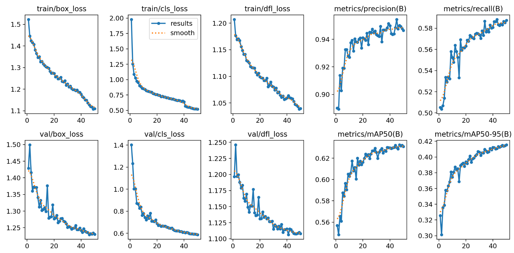
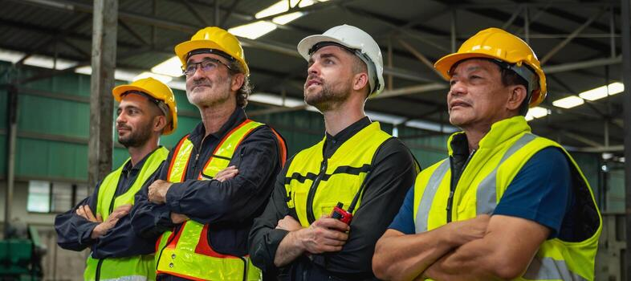
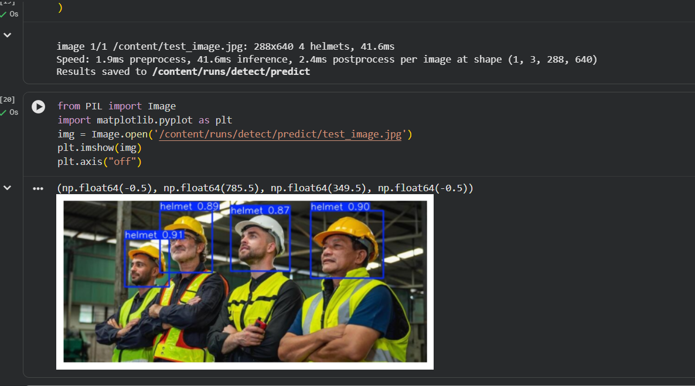

# 🪖 Helmet Detection using YOLOv8

A custom **Helmet Detection System** built using **YOLOv8** to detect construction safety equipment in **images and videos**. The model is trained on the **Hard Hat Detection Dataset** and can identify:

- 🟢 Helmet
- 🔴 No Helmet (Head)
- 🔵 Person

The project covers the complete object detection pipeline, from dataset preparation to model training, evaluation, and inference.

---

# 🎥 Demo


---

# ✨ Features

- Custom-trained YOLOv8 model
- Detects helmets, heads, and persons
- Green bounding boxes for **Helmet**
- Red **"No Helmet"** warning for uncovered heads
- Confidence score visualization
- Image inference
- Video inference
- Custom dataset preprocessing pipeline

---

# 📌 Project Overview

This project implements an end-to-end object detection pipeline using **Ultralytics YOLOv8**.

The complete workflow includes:

- Parsing Pascal VOC XML annotations
- Converting XML annotations into YOLO format
- Preparing train and validation datasets
- Fine-tuning a pretrained YOLOv8 model
- Evaluating the model using Precision, Recall, and mAP
- Running inference on custom images and videos

---

# 📂 Dataset

**Dataset:** Hard Hat Detection Dataset

### Classes

| Class | Description |
|--------|-------------|
| 🪖 Helmet | Worker wearing a helmet |
| 👤 Head | Worker without a helmet |
| 🚶 Person | Full person detection |

---

# 🛠️ Tech Stack

- Python
- PyTorch
- Ultralytics YOLOv8
- OpenCV
- NumPy
- Google Colab

---

# ⚙️ Project Workflow

```text
Pascal VOC XML
        │
        ▼
XML → YOLO Label Conversion
        │
        ▼
Dataset Preparation
        │
        ▼
Train / Validation Split
        │
        ▼
YOLOv8 Fine-Tuning
        │
        ▼
Model Evaluation
        │
        ▼
Image & Video Inference
```

---

# 📊 Model Performance

| Metric | Score |
|---------|------:|
| Precision | **94.6%** |
| Recall | **58.7%** |
| mAP@50 | **63.1%** |
| mAP@50-95 | **41.6%** |

---

# 📈 Training Curves

<p align="center">

</p>

---

# 🖼️ Sample Predictions

## Input Image

<p align="center">

</p>

---

## Helmet Detection Output

<p align="center">

</p>

---

# 🚀 Installation

```bash
git clone https://github.com/your-username/Helmet-Detection-YOLOv8.git

cd Helmet-Detection-YOLOv8

python -m venv .venv
```

### Activate Virtual Environment

**Windows**

```bash
.venv\Scripts\activate
```

**Linux / macOS**

```bash
source .venv/bin/activate
```

Install dependencies

```bash
pip install -r requirements.txt
```

---

# 🚀 Running Inference

### Python

```python
from ultralytics import YOLO

model = YOLO("best.pt")

model.predict(
    source="image.jpg",
    conf=0.25,
    save=True
)
```

### Video

```python
from ultralytics import YOLO

model = YOLO("best.pt")

model.predict(
    source="video.mp4",
    conf=0.25,
    save=True
)
```

---

# 📁 Project Structure

```text
Helmet-Detection-YOLOv8/
│
├── .gitignore
├── Helmet_Detection.ipynb
├── predict.py
├── data.yaml
├── requirements.txt
├── README.md
├── best.pt
├── demo.gif
├── sample_results/
│   ├── input.jpg
│   ├── output.png
│   ├── results.png
│   └── test_video.mp4
└── LICENSE
```

---

# 🎯 Results

- Successfully trained a custom YOLOv8 model on the Hard Hat Detection dataset.
- Built a complete annotation conversion pipeline from Pascal VOC XML to YOLO format.
- Achieved **94.6% Precision** on the validation dataset.
- Performs helmet detection on both images and videos.
- Customized prediction visualization with:
  - 🟢 Green labels for **Helmet**
  - 🔴 Red labels for **No Helmet**

---

# 📚 What I Learned

Through this project, I learned how to:

- Prepare custom datasets for object detection
- Convert Pascal VOC XML annotations into YOLO format
- Fine-tune pretrained YOLOv8 models
- Evaluate object detection models using Precision, Recall, and mAP
- Perform image and video inference using a custom-trained model
- Visualize detection results using OpenCV
- Build an end-to-end computer vision pipeline

---

# 🔮 Future Improvements

- Improve recall with additional training data
- Experiment with larger YOLOv8 models (YOLOv8s / YOLOv8m)
- Real-time webcam inference
- Multi-object tracking using ByteTrack
- PPE Detection (Helmet + Safety Vest)
- Workplace safety dashboard using Streamlit
- Edge deployment on Jetson Nano / Raspberry Pi

---

# 📜 License

This project is intended for educational, research, and portfolio purposes.

---

## ⭐ If you found this project useful, consider giving it a star!